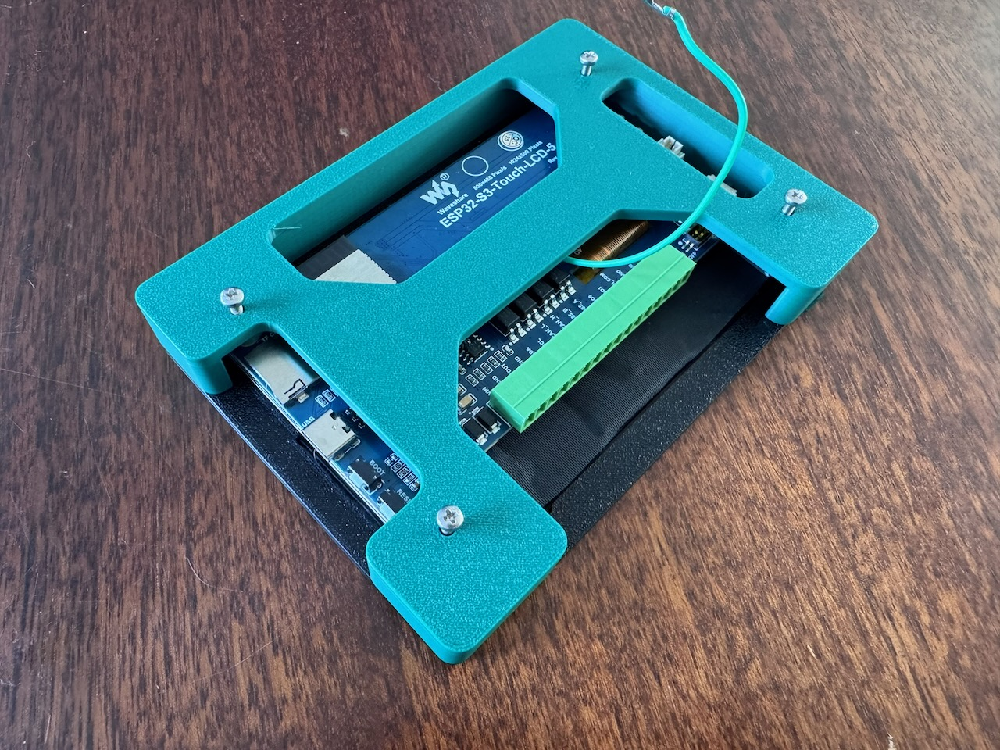
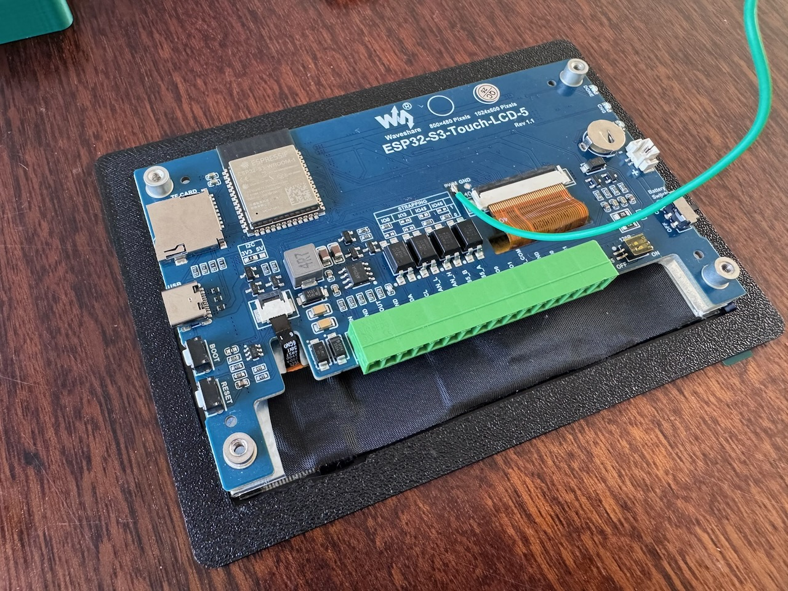
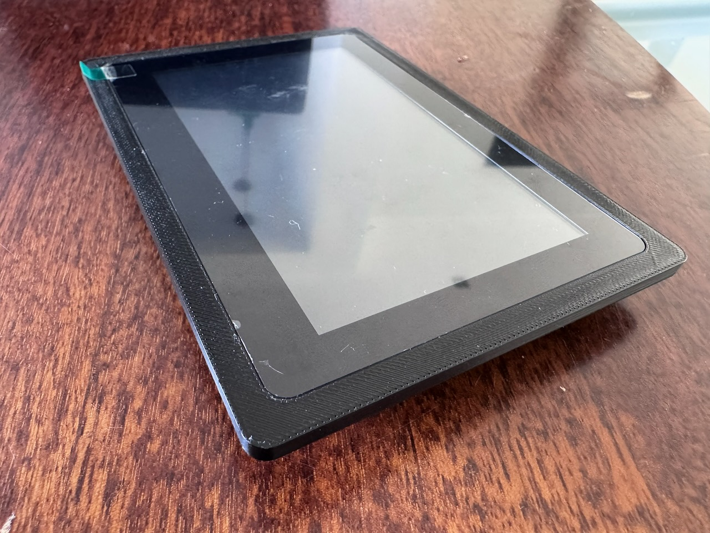
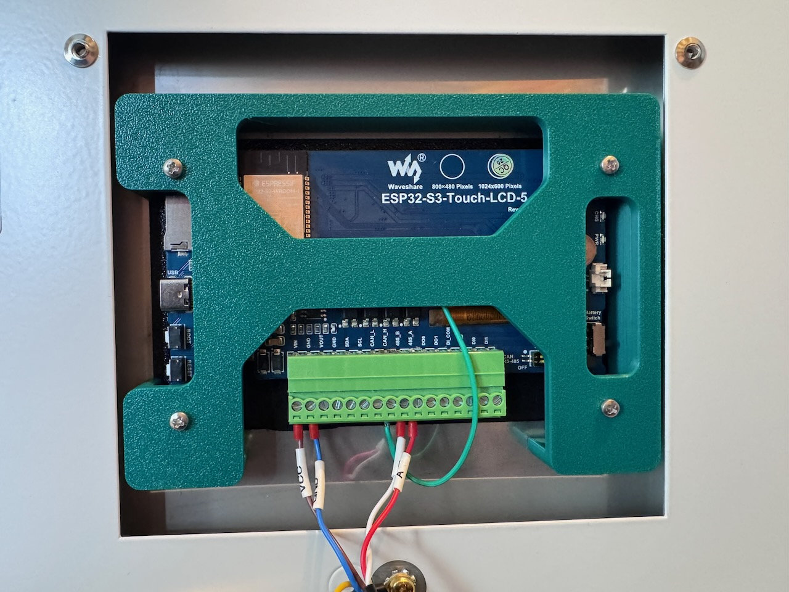
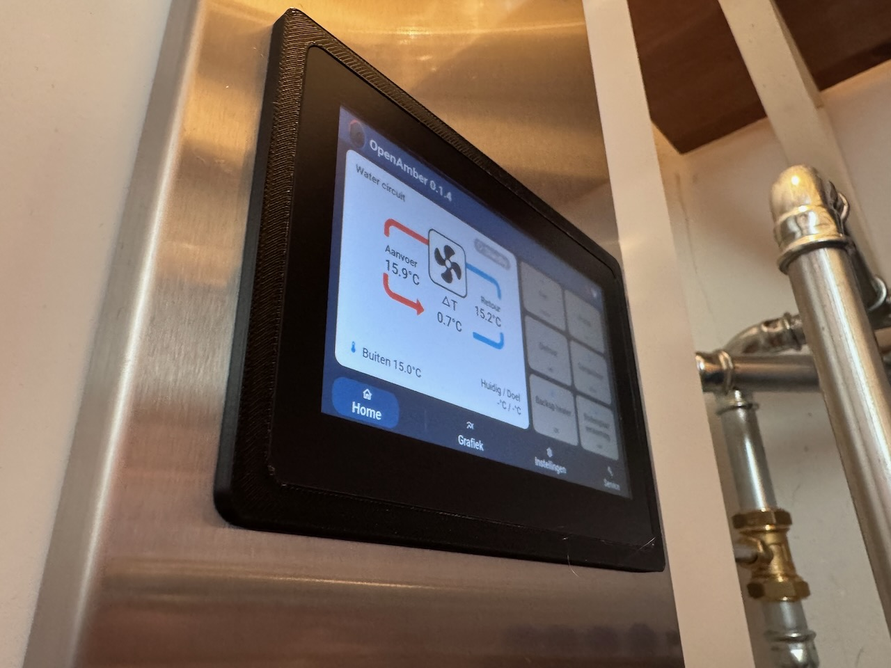

# Waveshare 5" integration in Itho Daalerop Amber
This document describes the steps for the integration of the Waveshare ESP32-S3 Touch LCD 5'' (https://www.waveshare.com/wiki/ESP32-S3-Touch-LCD-5) 
into the control module of the Amber heat pump.

Requirements for the assembly:
- 3D printed models:
  - [OpenAmber Screen Bracket Part 1.stl](./OpenAmber_Screen_Bracket_Part1.stl)
  - [OpenAmber Screen Bracket Part 2.stl](./OpenAmber_Screen_Bracket_Part2.stl)
- 4x M2.5x10mm screws

The 3D print models can be printed without support and with default settings for infill (15%).

In the following picture the overview of the assembly can be seen. 

## Step 1: Stick part 1 to the screen module

To protect the screen when it is squeezed to the control unit (and for looks), 3D print part 1 is attached to the Waveshare screen module by using the 3M tape that is already fitted to the screen module. 
Remove the tape protector and align the bracket with the made cutouts for the switches and ports. When pressing down (gently) the screen should sink in neatly with the 3D print as shown in the picture below.

(Note that there is a wire attached to the PWM solder point of the screen module, this is done such that the screen module backlight can be turned off correctly once the other end is attached to CAN_H terminal. 
This is supported in the firmware as of release [0.1.2](https://github.com/Jordi1990/openamber/tree/0.1.2))

## Step 2: Mount the assembly into the control unit

Now the screen assambly can be mounted into the Amber control unit by inserting the assembly from the front and securing bracket (3D print part 2) from the other side to the assembly by using the screws.
Pre-inserting one screw into this bracket helps when working with two hands only, loosely tightnening this one screw will hold the assembly in place for a bit. Tightening the screws will lock the screen in place.

## Result
The completed integration!

