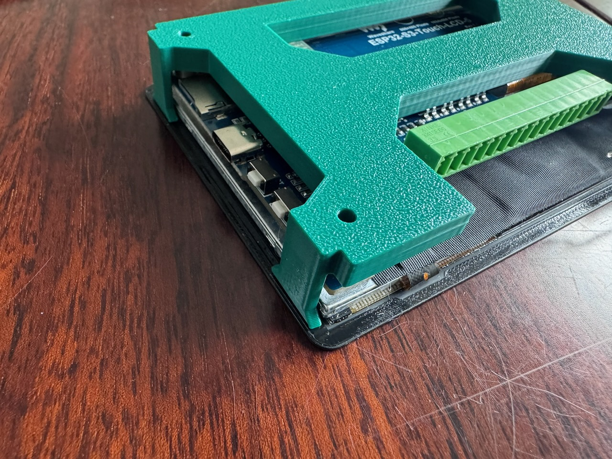
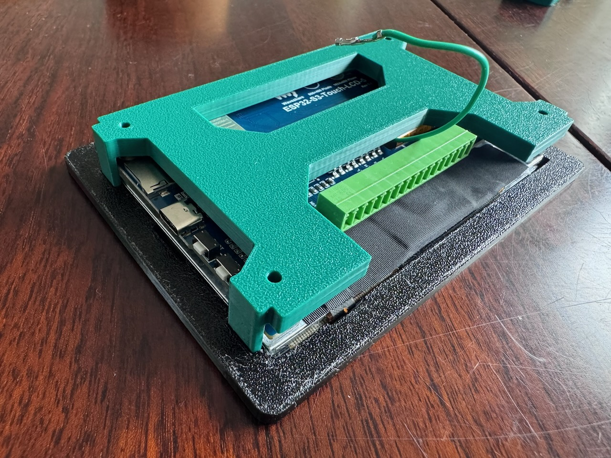
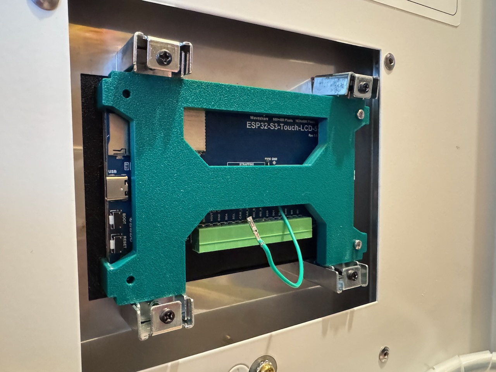
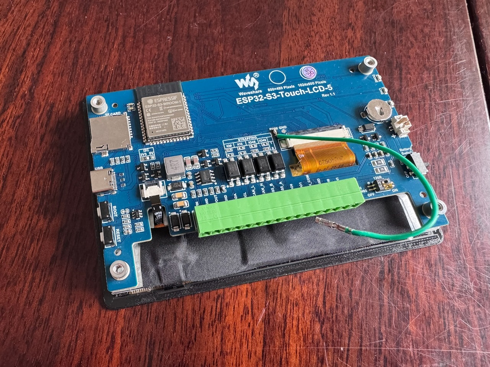

# Waveshare 5" integration in Itho Daalerop Amber
This document describes the steps for the integration of the Waveshare ESP32-S3 Touch LCD 5'' (https://www.waveshare.com/wiki/ESP32-S3-Touch-LCD-5) 
into the control module of the Amber heat pump.

Requirements for the assembly:
- 3D printed models:
  - [OpenAmber Screen Bracket Part 1.stl](./OpenAmber_Screen_Bracket_Part1-v2.0.stl)
  - [OpenAmber Screen Bracket Part 2.stl](./OpenAmber_Screen_Bracket_Part2-v2.0.stl)
- 4x original Amber screen tighteners
- Optional: 4x M2.5x10mm screws

The 3D print models can be printed without support. The design has been tuned for 0.2mm layer height, but other heights will probably also work.

The general concept for the bracket design is an interlocking mechanism that sticks to the 3M tape that comes attached to the Waveshare module. By using the original metal screen tighteners, no additional tools are required to securing the screen module. 

## Step 1: Back bracket

First of all remove the 3M tape protector from the Waveshare module. Then place Part 2 to the back of the screen module, align it such that the cut out in the bracket aligns with the terminal connector.

## Step 2: Screen bracket

Align Part 1 with the screen and back bracket from the back, note the cutouts in this part for the USB port and switch. Slide Part 1 over the back bracket and press it on to the exposed 3M tape of the screen. The glass of the Waveshare screen should sink neatly into this part, if is does not sink in properly the sceen will also not stick to the bracket. This step will mechanically lock the back bracket, that was used in step 1, in its place.

## Step 3: Placement in control module

Mount the Waveshare module (with the newly attached bracket) in the Amber control module. Using the screen tighteners that were used to secure the original screen, secure the assembly in place. Do not overdo it as it is a 3D printed part. Optionally 4 screws can be added for an extra security if the 3M would ever stop sticking, but note that these screw terminals on the Waveshare module are also secured by 3M tape. 

## Result
The completed integration!

## Backlight mod using PWM solder point

Note in the pictures above that there is a wire attached to the PWM solder point of the screen module, this is done such that the screen module backlight can be turned off correctly once the other end is attached to CAN_H terminal. This is supported in the firmware as of release [0.1.2](https://github.com/Jordi1990/openamber/tree/0.1.2)

